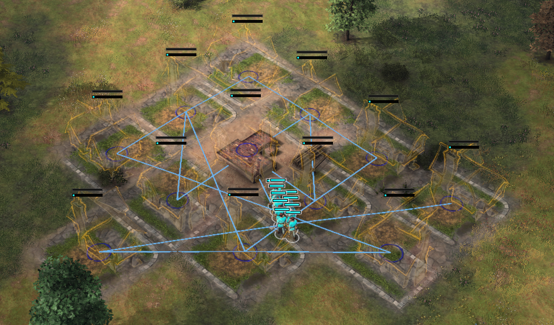

# L’utilisation du clavier

Age of Empires IV est un jeu dans lequel il est important de savoir **gérer plusieurs choses à la fois**. 

En effet, entre la gestion de vos unités militaires, la collecte de ressources, la construction de bâtiments, l'utilisation des éclaireurs pour espionner son adversaire, la réflexion à un plan de jeu, la défense de sa base, l’attaque de celle de son adversaire etc…, **il peut être facile de s’y perdre**. 

Il est ainsi important de s’améliorer dans le **multitasking** (gestion de plusieurs tâches en même temps).

_Raccourcis clavier (Q) pour la commande de déplacement d’attaque_

**L’utilisation du clavier s’avère primordiale pour gérer différentes choses en même temps** dans le jeu Age of Empires IV. En effet, plusieurs outils sont à votre disposition grâce au clavier pour faciliter la gestion d’un nombre important de tâches en simultané. En voici une liste non exhaustive : 

**Les raccourcis clavier : Chaque action** telle qu’un ordre de déplacement d’attaque, de construction d’un bâtiment, de construction d’une unité etc… **possède un raccourci clavier attitré**. En effet, afin d’effectuer un **déplacement d’attaque**, il vous suffit de sélectionner une unité militaire, **d’appuyer sur la touche clavier “Q”** et de cliquer avec le **clic gauche de la souris à l’endroit souhaité**.

Pour construire une maison, il vous suffit de sélectionner un villageois et **d’appuyer deux fois sur votre touche de clavier “A” et enfin de cliquer sur le clic gauche de votre souris**. Ces différentes actions effectuées avec votre clavier vous permettent de **gagner un temps précieux** en évitant d’aller chercher les différents éléments avec votre souris. **Nous vous invitons à réaliser vos tâches le plus possible avec les raccourcis clavier** afin de **gagner en efficacité et ainsi être plus rapide que votre adversaire**. Vous pourrez par conséquent réaliser plus d’actions que lui en un temps donné et donc de prendre l’avantage.

_Utilisation des raccourcis clavier pour construire une maison : 1 appuyez sur “A” (cercle rouge) puis 2 appuyez sur “A” (cercle bleu)_

Vous pouvez vous entraîner à l’apprentissage des différents raccourcis grâce à cet outil : [Aegis](https://aoe-aegis.vercel.app/). 

Nous vous invitons également à regarder tous les raccourcis claviers disponibles dans l’onglet paramètres du jeu Age of Empires IV car certains raccourcis ne seront indiqués qu’à cet endroit. Sachez que vous aurez la **possibilité de modifier les raccourcis claviers à votre convenance**. Vous pourrez ainsi avoir un profil adapté à vos habitudes d’utilisation du clavier. Pour cela, rendez-vous dans **“Paramètres”, “Commandes”, “Voir et configurer les commandes”**.

## Les groupes de contrôles

Un raccourci clavier très utile et primordial dans le jeu Age of Empires IV est l’utilisation des groupes de contrôles. Grâce à ceux-ci, **vous pourrez gérer différentes unités ou productions de bâtiments, simplement avec le clavier**, sans même à avoir à vous déplacer avec votre souris. Afin de **créer un groupe de contrôle, sélectionnez le(s) bâtiment(s) et/ou la ou les unité(s) souhaité(s), maintenez ensuite la touche ctrl de votre clavier et appuyez sur 1 ou 2 ou 3 etc…** Ainsi vous venez de créer le ctrl 1 (ou 2 ou 3 etc…). Suite à la création de ce ctrl, vous pourrez à tout instant **appuyer sur la touche 1** (ou 2 ou 3 etc…) **pour sélectionner les éléments de votre groupe de contrôle**. Appuyer **deux fois rapidement** sur cette même touche pour **sélectionner les éléments du groupe et centrer votre caméra sur ceux-ci**. 

Les groupes de contrôles vous seront d'une utilité capitale pour **gérer plusieurs choses à la fois**. Par exemple, si vous placez vos bâtiments militaires sous un groupe de contrôle, vous pourrez en gérer la production à distance, sans avoir besoin de les chercher sur la carte ou avec votre souris. Combinez cela avec l’astuce précédente vous permettra de lancer une armée en production rapidement grâce aux raccourcis clavier et vous n’aurez même pas besoin de déplacer votre souris. 

Une autre utilité courante des **groupes de contrôle** est la **gestion de votre armée**. Vous pourrez ainsi placer **chaque type d’unité sous un groupe de contrôle** afin de **mieux gérer les forces et faiblesses de chacune de vos unités** en les dirigeant séparément d’autres types d’unités. Il existe une multitude d’utilisation des groupes de contrôles et nous vous invitons à en utiliser **le plus possible** pour **améliorer votre gestion d’armée ou encore votre multitasking**.

_Utilisation possible des groupes de contrôles : la gestion de son armée. Le groupe 1 contient les archers longs Anglais, le groupe 2 les hommes d’armes et le groupe 3 les arbalétriers._

## Le maj-click (shift-click)

Vous voulez **donner plusieurs ordres à une unité** mais vous n’avez pas le temps d’attendre que celle-ci ait fini les précédents pour lui en donner un nouveau ?

Nous avons la solution avec **le maj-clic ou shift-clic**. Vous pouvez donner **une liste de commandes** à vos unités dans le jeu Age of Empires IV. Cet outil peut s’avérer des plus utiles si vous n’avez pas beaucoup de temps à consacrer à la gestion de certaines unités ce qui sera souvent le cas. Lorsque vous **donnez une liste de commande à une unité**, celle-ci va **s'atteler à la tâche et réaliser chacune de vos commandes dans l’ordre que vous lui avez donné**. Pour cela, **sélectionnez une unité, donnez lui un ordre puis enfoncez la touche maj (ou shift) de votre clavier et continuez de lui donner d’autres ordres**. L’unité va ainsi effectuer les ordres les uns à la suite des autres.

_Liste de commandes effectuées grâce à l’utilisation du Maj-clic : les archers Anglais vont se déplacer de drapeau en drapeau jusqu’à atteindre le dernier_

L’utilisation de la liste de commande ne s’applique pas uniquement aux unités. Vous pouvez également l’utiliser avec le point de ralliement de vos bâtiments de production. Les unités qui sortiront de ce bâtiment suivront ainsi la trajectoire que vous aurez indiquée avec les différents points de ralliement. 

_Liste de commandes effectuées grâce à l’utilisation du Maj-clic : les villageois vont construire les maisons une par une dans l’ordre de commande jusqu’à toutes les avoir construites._

## La touche tabulation

Vous avez sélectionné une large troupe d’unités avec plusieurs types différents et vous ne souhaitez pas donner les mêmes ordres à ces différentes unités ? Ne vous en faites pas, il existe une solution. 

**La tabulation peut vous permettre de passer de la troupe entière de vos unités sélectionnées à un groupe d'unités du même type**. Par exemple si vous sélectionnez des piquiers et des villageois, mais que vous ne voulez donner **un ordre uniquement à vos villageois**, vous n’aurez qu’à appuyer sur votre touche clavier tabulation **jusqu’à ce que les villageois soient sélectionnés**. Vous pourrez ainsi **donner un ordre uniquement aux villageois** et ce même si vous aviez sélectionné des piquiers en même temps. L’utilisation de la tabulation peut également s’avérer très utile lorsque vous souhaitez **produire des unités**. Vous pouvez par exemple sélectionner tous vos bâtiments militaires (voir ci-après) et appuyer sur **tabulation pour gérer vos casernes, puis vos écuries, puis vos archeries etc….**

## Conseils supplémentaires

Nous vous conseillons vivement d’utiliser certains raccourcis claviers qui vous seront des plus utiles dans vos parties de Age of Empires IV. 

Parmi ces raccourcis, nous vous conseillons **d’utiliser la sélection de toutes vos unités militaires** afin de mieux gérer votre armée. Mais aussi **la sélection de tous vos bâtiments militaires** afin de mieux gérer la production de vos armées (à coupler avec l’utilisation de la tabulation). Enfin, il peut également être intéressant d’utiliser le raccourci vous permettant de **sélectionner tous vos bâtiments technologiques** afin de bien gérer l'amélioration de vos technologies, y compris **les technologies économiques** ou encore **militaires**. Vous pouvez placer ces commandes sur n’importe quelle touche du clavier non utilisées et accessibles facilement pour vous. Souvent, les joueurs aiment placer ces actions sur les touches F1, F2, F3 etc…