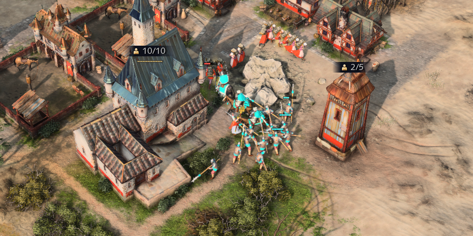

# La gestion de l’armée (micro)

La **gestion de l’armée** peut s’avérer très importante pour **battre l’armée de son adversaire, détruire son économie** ou encore pour **se sortir de situations compliquées**. Cette gestion des unités militaires est également appelée **micr**o** et voici quelques conseils pour mieux la maîtriser :

## Les technologies

Le premier conseil serait de bien **développer les technologies pour améliorer votre armée**.

Il existe plusieurs types de technologies militaires.

Tout d’abord, les **technologies se trouvant dans la forge** vous permettant d’augmenter l’attaque ou encore la défense de vos unités. Ces technologies peuvent également vous permettre d’augmenter le taux de production de vos bâtiments militaires ou même de construire des engins de siège avec vos unités d'infanterie.

_Les technologies issues de la forge vous permettant d’améliorer vos unités militaires._

Ensuite, les **technologies uniques** de votre civilisation, vous permettant de **jouer sur votre force de civilisation** et de terrasser votre adversaire avec de puissantes unités. Ces technologies seront disponibles dans des bâtiments divers, en fonction de la civilisation jouée.

## La règle des contres

Lorsque l’on souhaite bien appréhender la micro, il est nécessaire de bien comprendre **les contres d’unités**. **Chaque unité possède des forces et des faiblesses**. Chaque unité sera donc forte contre certains types d’unités et faible contre d’autres. 

En comprenant bien ce système, vous serez capable **d’orienter votre production d’armée en fonction de celle de votre adversaire**, mais aussi, lors de la bataille, **d’attaquer les unités de vos adversaires par vos unités qui les contrent**.

Il existe un système de **pierre, feuille, ciseaux** dans le jeu Age of Empires IV permettant de comprendre **les forces et faiblesses de bases des unités les plus courantes dans le jeu**. Les unités les plus courantes étant les **archers, les cavaliers et les piquiers**. 

Les piquiers sont puissants contre les cavaliers mais faibles contre les archers.  
Les archers, quant à eux, sont puissants contre les piquiers mais faibles contre les cavaliers.  
Il est alors logique que les cavaliers soient forts contre les archers et faibles contre les piquiers. 

**Ces interactions entre ces 3 unités présentent les bases de la compréhension des contres d’unités** dans le jeu Age of Empires IV

Mais nous sommes tous d’accord pour dire qu’il existe bien plus que 3 types d’unités dans ce jeu. En effet, il existe également des unités blindées tels que les chevaliers ou les hommes d’armes. 

Il existe également les arbalétriers ou les escopetiers, sans compter toutes les unités de sièges ou même les unités uniques de chaque civilisation etc…

**Chacune des forces et faiblesses de vos unités se trouvera dans leur description.** Vous pourrez retrouver cette description dans les **“Premiers pas”** dans l’onglet d’accueil du jeu que nous avons évoqué [précédemment](./fondamentaux/civilization).

**Il vous sera également possible d’obtenir ces caractéristiques en passant votre souris sur le cadre d’unité en jeu.**

N’hésitez pas à découvrir toutes les unités du jeu, y compris les unités uniques, afin de bien comprendre tous les contres d’unités et de jouer sur leurs forces et faiblesses pour prendre l'avantage. Vous trouverez ci-joint un résumé des interactions de bases entre les unités les plus répandues dans le jeu Age of Empires IV

## Les formations

Les **positions d’armées** sont un élément important dans le jeu Age of Empires IV.

Elles peuvent vous permettre **d’éviter des dégâts de zones** ou **d’infliger plus de dégâts** en permettant à plus de vos unités d’être à portée de tir par exemple.

_Formation standard des unités militaires représentées par un bataillon d’archers longs Anglais._

**La position standard** de vos unités **peut vous faire défaut dans certaines situations**. En effet, lorsque vous jouez avec des archers, il peut être intéressant d’adopter **la position en ligne** afin que tous vos archers soient à portée de tir et donc qu’ils **infligent plus de dégâts à vos adversaires**. D’un autre côté, cette position peut les rendre **d’autant plus vulnérable** aux charges de cavalerie par exemple. 

_Formation en ligne exécutée par un bataillon d’archers longs Anglais._

Les positions peuvent également être intéressantes afin **d’éviter des dégâts de zone** comme ceux infligés par les mangonneaux. En effet, utiliser la position qui permet à vos unités de s’écarter les unes des autres, peut vous permettre de **réduire le nombre d’unités touchées** et donc de pouvoir gagner des batailles.

_Formation échelonnée exécutée par un bataillon d’archers longs Anglais._

## Le Hit & run

Lorsque vous jouez **des archers**, une technique de micro (gestion des unités), appelée **Hit & run (Taper et Courir)**, peut vous permettre de gagner des batailles. Le Hit & run consiste à **faire un tir avec vos archers puis de les reculer le temps de la recharge et de répéter cette opération le plus possible**. Cette technique, permet de garder une distance entre vos archers et les unités de votre adversaire vous permettant ainsi **d’infliger des dégâts avec vos archers, tout en évitant d’en subir**.

Le Hit & run **fonctionne particulièrement bien contre toutes les unités peu mobiles** telles que les hommes d’armes ou les piquiers. **Contre des cavaliers, le Hit & run s’avère nettement moins efficace du fait de la rapidité de déplacement** des unités montées. Toutefois, nous vous recommandons tout de même d’utiliser la technique du **Hit & run dès que l’occasion se présente** afin d’infliger des dégâts à votre adversaire, sans que celui-ci ne puisse vous rendre les coups.

## Choisir la position

De manière générale, si vous souhaitez mieux gérer votre armée et ainsi remporter vos batailles, il est préférable de **choisir les moments mais aussi les endroits où vous vous battez.** 

En effet, si vous décidez de vous **combattre sous le château de votre adversaire**, **vous aurez un net désavantage**. De la même manière si votre adversaire possède des mangonneaux (unités de sièges infligeant des dégâts de zone), il est fortement déconseillé de vous battre dans **un goulet d’étranglement**.

Quoiqu’il en soit, **choisir l’endroit d’une bataille ne doit clairement pas être pris à la légère**. Ce choix pouvant mener à une issue de bataille totalement différente. Cependant, il n’y a pas que le choix du lieu qui soit important dans la prise de décision. En effet, **le moment de la bataille peut s’avérer capital** si l’on veut s’assurer de l’issue de celle-ci. 

## Avoir l'avantage technologique 

Comme évoqué précédemment, les technologies développées peuvent jouer un grand rôle dans la puissance de vos unités. Il peut donc être **important de se battre lorsque vos unités possèdent un avantage technologique** par rapport à celles de votre adversaire.

Il peut ainsi être très important de comprendre **que vous ne devez pas combattre un adversaire qui se trouve Age 3** avec les technologies d’armées développées **si vous vous trouvez à l’Age 2**. Excepté évidemment si vous possédez une armée beaucoup plus importante que celle de votre adversaire et que vous souhaitez lui infliger des dommages économiques. Quoi qu'il en soit, il sera toujours plus intéressant de combattre votre adversaire **lorsque vous possédez un avantage par rapport à celui-ci**, qu’il soit **dû au terrain, à la position de la bataille ou encore à l’avancée de vos technologies ou même de la composition de vos armées à un moment T**.

_Défense Anglaise parée à un assaut adverse._

## Utiliser sont armée

L’un des conseils les plus importants dans le jeu Age of Empires IV est **d’utiliser son armée afin d’infliger des dégâts à son adversaire**. La meilleure manière d’infliger des dégâts à son adversaire est de **réduire son économie** et pour cela il faut soit : 
 * **Tuer les villageois de son adversaire** 
 * **L’empêcher de prendre des ressources**
 * **L’embêter dans sa prise de ressources en envoyant des unités militaires pour créer ce que l’on appelle de l’iddle** (L’iddle représente le temps perdu par les villageois à ne pas récolter des ressources).
 * **Détruire des bâtiments ou unités que votre adversaire devra reconstruire**

Ainsi, la meilleure gestion d’armée que vous pouvez faire dans le jeu Age of Empires IV n’est pas forcément de remporter toutes vos batailles militaires mais plutôt d’**utiliser votre armée pour prendre le contrôle de la carte** afin de vous accaparer des ressources et empêcher votre adversaire d’en disposer; **mais aussi de détruire le plus possible l’économie de votre adversaire tout en protégeant la vôtre** afin de prendre l’ascendant économique et par conséquent militaire par la suite.

_Attaque des villageois du Saint Empire Romain par l’armée Rus’._
